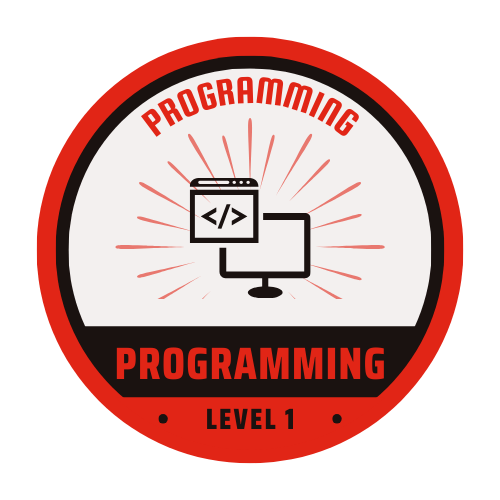
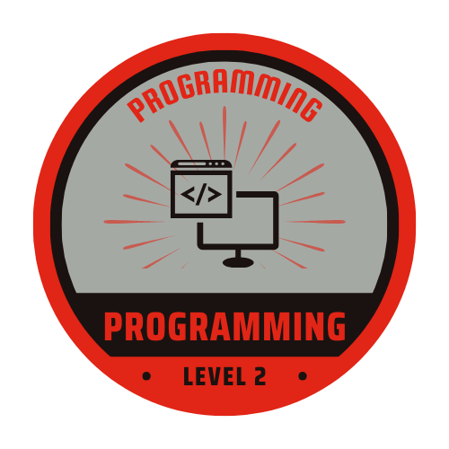
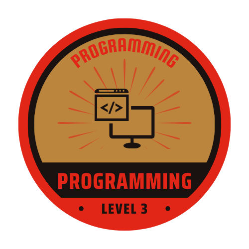

Badges
======================================

In order to help better educate and train our students, ROBOTZ Garage has implemented a "Badge" system in order to assess and document what each student studies. 
Each badge is cummulative. Each topic within each badge will contain a module that should be completed by students, and approved by the programming team mentor.

All students that are interested in the programming team should, *at minimum*, complete Badge 1. Students who are interested in becoming Programming Lead will need to complete all modules and signed off by the programming mentor.

Given the (mostly) open-sourced nature of FRC programming, we will primarily focus on open source software that can be implemented in our robots. For software that is open-source, 
links will be utilized to provide the most up-to-date information for said topics.

Links to rubrics to return to the Programming Mentor are as follows:

.. grid:: 3

    .. grid-item-card::
        :link: https://docs.google.com/document/d/1UkBSreUpE-XdjYRHUtV24TLm_pyeRawpKTU6c84k2Bg/view
        :link-type: url

        Programming Badge 1 Rubric

    .. grid-item-card::
        :link: https://docs.google.com/document/d/1B44JuYrtnrOuBnOI93U_-20w19ZC9nhtd3NMdjjMd_4/view
        :link-type: url

        Programming Badge 2 Rubric

    .. grid-item-card::
        :link: https://docs.google.com/document/d/1-bYXrq0n7ryA1F5aH4EbBwt4rHYu3ZVVARNtJwFmmH0/edit
        :link-type: url

        Programming Badge 3 Rubric                

.. toctree::
   :caption: Badge 1: Beginners
   :hidden:

   1/wpilib
   1/java
   1/data_structures
   1/driver_station
   1/joysticks
   1/motors
   1/radio
   1/advantagescope
   1/basic_control_systems
   1/subsystems
   1/commands
   1/simulation
   1/triggers
   1/git

.. toctree::
   :caption: Badge 2: Intermediate
   :hidden:

   2/advantagekit
   2/control_loops
   2/pid_controls
   2/feedforward
   2/trapezoid_profiles
   2/odometry
   2/pathplanner
   2/photonvision

.. toctree::
   :caption: Badge 3: Expert
   :hidden:

   3/choreo
   3/mechanisms
   3/superstructures
   3/network_tables
   3/advanced_coprocessors